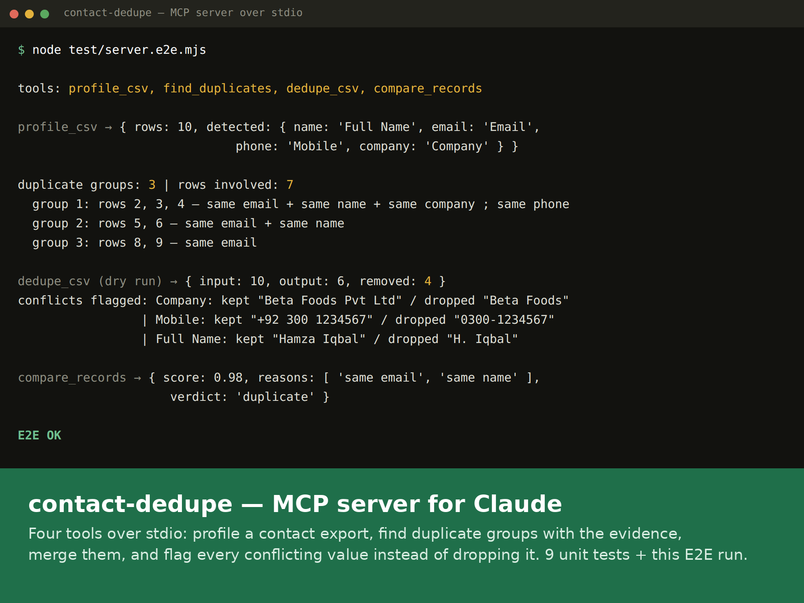
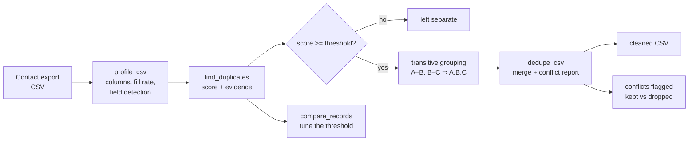

# contact-dedupe — MCP server

`OPEN-SOURCE UTILITY`

[](https://github.com/skmalikllc/contact-dedupe-mcp/actions/workflows/tests.yml)
[](LICENSE)

An MCP (Model Context Protocol) server that lets Claude, or any MCP client, work
on a contact export: profile it, find the rows that are the same person, and
write a merged file — with every conflicting value reported instead of quietly
dropped.

Built for the job I get asked for most often: a CRM or Google Contacts export
where the same person appears three times as `Ali Raza`, `Raza, Ali` and
`Ali R.`, with the phone number on one row and the email on another.

> **Open-source utility.** Written by me from scratch on a synthetic sample
> file. It contains no client data and is not any client's production system.



## Features

- **Four tools over stdio** — profile, find, merge, compare.
- **Evidence, not a black box.** Every duplicate group comes back with the
  signals that matched it, so a human can sanity-check the result before any
  file is written.
- **Dry run by default in practice.** `dedupe_csv` accepts `dry_run`, so you can
  see the row counts before committing to an output file.
- **Conflicts are reported, never silently dropped.** If two rows disagree on
  the company name, both values come back in the report.
- **No external CSV dependency.** RFC 4180 reader/writer written in the repo.

| Tool | What it does |
|---|---|
| `profile_csv` | rows, columns, fill rate per column, and the detected name/email/phone/company mapping |
| `find_duplicates` | duplicate groups with the evidence behind each match — read-only |
| `dedupe_csv` | merges each group into one row, writes a cleaned CSV (`dry_run` supported) |
| `compare_records` | scores a single pair 0–1 and lists the signals, for tuning the threshold |

## Example input and output

`sample/contacts.csv` — 10 rows, messy on purpose:

```csv
Full Name,Email,Mobile,Company,City
Ali Raza,Ali.Raza@gmail.com,+92 300 1234567,Acme Traders,Lahore
"Raza, Ali",aliraza+crm@gmail.com,,Acme Traders,Lahore
Ali R.,,0300-1234567,Acme,
...
```

Three rows, one person: the second has no phone, the third has no email, and
the names are written three different ways.

Running the end-to-end script prints the real protocol response:

```
duplicate groups: 3 | rows involved: 7
  group 1: rows 2, 3, 4 — same email + same name + same company ; same phone
  group 2: rows 5, 6 — same email + same name
  group 3: rows 8, 9 — same email

dedupe_csv (dry run) → { input: 10, output: 6, removed: 4 }
conflicts flagged: Full Name: kept "Ali Raza" / dropped "Raza, Ali"
                 | Email: kept "Ali.Raza@gmail.com" / dropped "aliraza+crm@gmail.com"
                 | Mobile: kept "+92 300 1234567" / dropped "0300-1234567"
                 | Company: kept "Acme Traders" / dropped "Acme"
                 | Company: kept "Beta Foods Pvt Ltd" / dropped "Beta Foods"
                 | Full Name: kept "Hamza Iqbal" / dropped "H. Iqbal"

compare_records → { score: 0.98, reasons: [ 'same email', 'same name' ],
                    verdict: 'duplicate' }
```

## Architecture



```
src/server.mjs   MCP protocol only — tool definitions and zod schemas
src/dedupe.js    matching, grouping and merge logic — no protocol code
src/csv.js       RFC 4180 reader/writer — no dependencies
```

The matching logic holds no MCP code on purpose. The rules that decide whether two
people are the same are the part worth testing on their own.

## Matching rules

Exact-match dedupe misses most real duplicates, and fuzzy name matching alone
merges people who merely share a surname. So the score comes from several
signals:

- **Email** — `Ali.Raza@gmail.com` and `aliraza+crm@gmail.com` are the same
  mailbox, but `a.b@outlook.com` and `ab@outlook.com` are **not**; the dot rule
  is a Gmail behaviour, not a general one.
- **Phone** — compared on the last 9 digits, so `+92 300 1234567`,
  `0300-1234567` and `00923001234567` line up without guessing a country.
- **Name** — accent- and punctuation-insensitive, order-insensitive
  (`Raza, Ali` = `Ali Raza`), Levenshtein for the rest.
- **Company** — only ever a tie-breaker on top of a name match.

A shared email or phone is strong evidence; a similar name on its own is not
enough to merge. Groups form transitively (A–B by phone, B–C by email puts all
three together), and the threshold is a parameter, not a hard-coded constant.

Merging keeps the most complete row as the base, fills blanks from the others,
prefers the longer value when one contains the other (`Beta Foods` →
`Beta Foods Pvt Ltd`), and reports everything else as a conflict.

## Use cases

- Cleaning a Google Contacts or CRM export before importing it somewhere new.
- De-duplicating a mailing list that was merged from several sources.
- Checking how bad a duplicate problem is (`profile_csv` + `find_duplicates`)
  before deciding whether a migration is safe to run.
- Tuning a match threshold on real pairs with `compare_records` instead of
  guessing.

## Who this is useful for

Anyone about to import a contact list into a new system — agencies, small
businesses moving CRM, VAs maintaining a list — and anyone using Claude who
wants that cleanup done inside the conversation rather than by hand in a
spreadsheet.

## Architecture

```
src/server.mjs   MCP server (stdio) — tool definitions and zod schemas
src/dedupe.js    matching, grouping and merge logic (no protocol code)
src/csv.js       RFC 4180 CSV reader/writer, no dependencies
sample/          messy sample export
test/            unit tests + end-to-end MCP client test
.github/workflows CI: npm ci + npm test + npm run e2e on Node 20, 22 and 24
```

```
MCP client (Claude)  ──stdio──▶  src/server.mjs  ──▶  src/dedupe.js
                                        │                  │
                                        └──▶ src/csv.js ◀──┘
```

The matching logic holds no MCP code on purpose — the rules that decide whether
two people are the same are the part worth testing on their own.

## Installation

```bash
git clone https://github.com/skmalikllc/contact-dedupe-mcp.git
cd contact-dedupe-mcp
npm install
```

Register it with an MCP client (Claude Desktop / Claude Code):

```json
{
  "mcpServers": {
    "contact-dedupe": {
      "command": "node",
      "args": ["/absolute/path/to/contact-dedupe-mcp/src/server.mjs"]
    }
  }
}
```

Requires Node 20 or newer. Not published to npm.

## Testing

```bash
npm test      # 9 unit tests: normalisation, scoring, grouping, merge, CSV
npm run e2e   # protocol-level run over stdio against sample/contacts.csv
```

Both commands run in CI on Node 20, 22 and 24 — the badge above is that
workflow.

## Design decisions

**Why evidence instead of a verdict.** A dedupe tool that returns "these 40 rows are
duplicates" is unusable on a real client list, because the cost of a wrong merge is
much higher than the cost of a missed one. Every group comes back with the signals
behind it so a human can overrule it before a file is written.

**Why the threshold is a parameter.** The right cut-off depends on the list. A
membership database of one family name needs a different threshold from a B2B CRM.
`compare_records` exists so you can calibrate it on real pairs instead of guessing.

**Why no fuzzy-matching library.** The matching is a handful of specific,
explainable rules — Gmail dot and plus-tag normalisation, last-nine-digit phone
comparison, order-insensitive name comparison with Levenshtein for the remainder.
A generic similarity score would be harder to justify to a client and harder to tune.

**Why the CSV reader is written in-repo.** One fewer dependency in a tool that
handles client data, and RFC 4180 is small enough to implement correctly.

## Limitations

- **CSV only.** vCard, Outlook PST and direct CRM APIs are not supported.
- **Latin-script name matching.** The normalisation handles accents and punctuation;
  it is not tuned for non-Latin scripts.
- **The Gmail dot rule is Gmail-specific** and deliberately not applied to other
  providers, which is correct but means some genuine duplicates on other domains
  will be missed.
- **No fuzzy company matching** beyond containment — company is only ever a
  tie-breaker on top of a name match.
- **Single-file operation.** It does not merge two separate exports against each
  other; it deduplicates within one.

## Contributing

Issues and pull requests are welcome. If you are changing matching behaviour, add a
test to `test/dedupe.test.js` that captures the pair or group you are fixing — the
matching rules are the part of this repo where a regression is expensive.

```bash
npm install
npm test
npm run e2e
```

CI runs both on Node 20, 22 and 24. Please keep `src/dedupe.js` free of protocol code.

## Security and privacy

- Runs locally over stdio. No network calls, no telemetry, no API keys.
- Reads and writes only the file paths you pass in.
- `dry_run` lets you see the effect before any output file is written.
- The sample file is synthetic. Do not commit a real client export to a
  repository — run the server against it locally.

## Licence

MIT — see [LICENSE](LICENSE).
